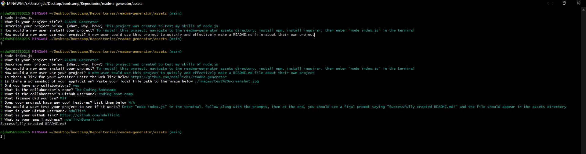

# README-generator

## Description

A readme generator for making 'readme.md' files quickly and accurately through the terminal

## Usage

To navigate to the Github repository to download the source code, click [here](https://github.com/ndallich1/readme-generator)

To see a walkthrough video of my README-generator, click [here](https://watch.screencastify.com/v/21d52AVUuh0HnXfhZ2IW)

## Installation

To install this project, navigate to the readme-generator assets directory, install npm, install inquirer, then enter "node index.js" in the terminal
