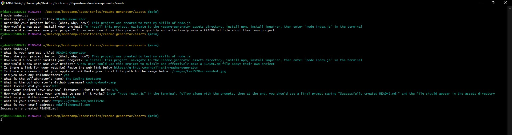

# README-Generator

## Description

This project was created to test my skills of node.js

## Table of Contents

- [Installation](#installation)
- [Usage](#usage)
- [Credits](#credits)
- [License](#license)

## Installation

To install this project, navigate to the readme-generator assets directory, install npm, install inquirer, then enter "node index.js" in the terminal

## Usage

A new user could use this project to quickly and effectively make a README.md file about their own project

To navigate to the web application in your browser, click [here](https://github.com/ndallich1/readme-generator)

## Credits

Collaborators include:

[The Coding Bootcamp](coding-boot-camp)

## License

MIT License

Copyright 2023 Nikki Dallich

Permission is hereby granted, free of charge, to any person obtaining a copy of this software and associated documentation files (the "Software"), to deal in the Software without restriction, including without limitation the rights to use, copy, modify, merge, publish, distribute, sublicense, and/or sell copies of the Software, and to permit persons to whom the Software is furnished to do so, subject to the following conditions:

The above copyright notice and this permission notice shall be included in all copies or substantial portions of the Software.

THE SOFTWARE IS PROVIDED "AS IS", WITHOUT WARRANTY OF ANY KIND, EXPRESS OR IMPLIED, INCLUDING BUT NOT LIMITED TO THE WARRANTIES OF MERCHANTABILITY, FITNESS FOR A PARTICULAR PURPOSE AND NONINFRINGEMENT. IN NO EVENT SHALL THE AUTHORS OR COPYRIGHT HOLDERS BE LIABLE FOR ANY CLAIM, DAMAGES OR OTHER LIABILITY, WHETHER IN AN ACTION OF CONTRACT, TORT OR OTHERWISE, ARISING FROM, OUT OF OR IN CONNECTION WITH THE SOFTWARE OR THE USE OR OTHER DEALINGS IN THE SOFTWARE.

## Features

N/A

## Tests

Enter "node index.js" in the terminal, follow along with the prompts, then at the end, you should see a final prompt saying "Successfully created README.md!" and the file should appear in the assets directory 

## Questions 

If you have any questions, please feel free to email me at ndallich@gmail.com. 

ndallich1
https://github.com/ndallich1
